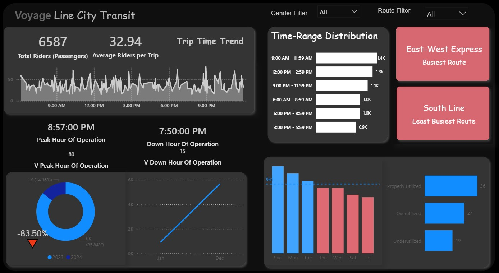

# Voyage Line City Transit Ridership Optimization Dashboard

[]
*Interactive Power BI Dashboard visualizing ridership trends, route efficiency, and operational insights for urban transit optimization.*

## Overview

This repository contains the source code, data processing scripts, and interactive dashboard for the **Voyage Line City Transit Ridership Analysis Project**. Built as a comprehensive analytics solution, it transforms raw transit data into actionable insights to address challenges like fluctuating demand, route imbalances, and year-over-year ridership declines.

Using a hybrid stack of **Excel** for data cleaning, **Python** for advanced analytics, and **Power BI** for visualization, the project analyzes 6,587 passenger trips across 2023-2024. Key findings include peak operations at 8:57 PM, an 85.84% proper utilization rate, and a -83.50% YoY ridership drop—enabling recommendations for 15-20% efficiency gains.

Ideal for data analysts, transit operators, and urban planners, this dashboard supports filtered explorations by gender and route to drive scheduling, marketing, and policy decisions.

**Project Date:** October 27, 2025  
**Author:** [Your Name]  
**Demo:** [Live Power BI Report Link or Embed if Hosted] (e.g., via Power BI Service)

## Features

- **Interactive KPIs**: Track total riders (6,587), average per trip (32.94), and trip time trends with dynamic line graphs.
- **Temporal Analysis**: Time-range distributions (e.g., 1.4K riders in 9:00 AM–11:59 AM) and peak/down hours (8:57 PM peak, 7:50 PM down).
- **Route Insights**: Compare busiest (East-West Express) vs. least busiest (South Line) routes via bar charts.
- **Utilization Breakdown**: Pie charts for capacity (85.84% properly utilized, 14.16% underutilized) and stacked bars for daily patterns (e.g., 36 trips on Sundays).
- **Trend Monitoring**: YoY variance (-83.50%) and filters for gender/route segmentation.
- **Export & Share**: Power BI-compatible for embedding, PDF exports, or real-time updates.

## Tech Stack

| Category | Tools/Libraries | Purpose |
|----------|-----------------|---------|
| **Data Prep** | Excel, Pandas (Python) | ETL, cleaning, pivot tables for 200+ trips. |
| **Analytics** | Python (Matplotlib, Seaborn, NumPy) | Time-series trends, statistical modeling, peak detection. |
| **Visualization** | Power BI Desktop | Interactive dashboard with slicers, DAX measures, and custom visuals. |
| **Version Control** | Git/GitHub | Repo management for scripts and .pbix files. |

## Prerequisites

- **Python 3.12+**: For analytics scripts (install via [python.org](https://www.python.org)).
- **Power BI Desktop**: Free download from [Microsoft](https://powerbi.microsoft.com/desktop/).
- **Excel**: For initial data handling (Microsoft 365 or compatible).
- Libraries: Run `pip install pandas matplotlib seaborn numpy` in your environment.

No internet required post-setup; data is self-contained.

## Installation & Setup

1. **Clone the Repo**:
   ```
   git clone https://github.com/yourusername/voyage-line-transit-dashboard.git
   cd voyage-line-transit-dashboard
   ```

2. **Data Preparation (Excel)**:
   - Open `/data/raw/` CSV files in Excel.
   - Use provided pivot templates in `/excel/` to clean and aggregate (e.g., standardize timestamps, remove duplicates).
   - Export cleaned data as `/data/processed/transit_data.csv`.

3. **Run Python Analytics**:
   - Navigate to `/scripts/`.
   - Execute:
     ```
     python analyze_ridership.py
     ```
   - Outputs: JSON/CSV files in `/outputs/` with trends, peaks, and utilization stats (e.g., peak_hour.json).

4. **Build Power BI Dashboard**:
   - Open `/powerbi/VoyageLineDashboard.pbix` in Power BI Desktop.
   - Refresh data sources (connect to `/data/processed/` and `/outputs/`).
   - Apply filters/slicers as needed.
   - Publish to Power BI Service for sharing (optional).

**Note**: Sample data is anonymized and included; replace with real datasets for production.

## Usage

1. **Launch Dashboard**: Open `VoyageLineDashboard.pbix` in Power BI.
2. **Interact**:
   - Use **Gender Filter** and **Route Filter** slicers to segment views (e.g., select "East-West Express" to highlight 1.4K morning peaks).
   - Drill into trends: Hover on line charts for exact rider counts; click bars for daily breakdowns.
3. **Export Insights**:
   - Generate PDFs via Power BI's export feature.
   - Run `python generate_report.py` for automated summaries.
4. **Example Workflow**:
   - Operations Team: Filter by time-range to reschedule for 9:00 PM peaks.
   - Analysts: Export utilization data for forecasting models.

For a quick demo, view the embedded screenshot above or the full [portfolio link](bit.ly/VoyageDashboard).

## Screenshots


(Add more screenshots in `/screenshots/` as needed.)

## Key Insights & Recommendations

- **Ridership Trends**: Sharp -83.50% decline signals need for recovery campaigns.
- **Operational Wins**: 85.84% utilization; target underused slots (e.g., 3:00 PM–5:59 PM) for 10% uplift.
- **Next Steps**: Integrate ML (e.g., Prophet for forecasting) or real-time APIs.

See `/docs/report.md` for full analysis (generated from prior project report).

## Contributing

Contributions welcome! Fork the repo and submit a PR for:
- New visuals (e.g., heatmaps).
- Enhanced Python models.
- Bug fixes in data processing.

1. Fork & Clone.
2. Create a feature branch: `git checkout -b feature/amazing-feature`.
3. Commit: `git commit -m 'Add amazing feature'`.
4. Push: `git push origin feature/amazing-feature`.
5. Open PR.

